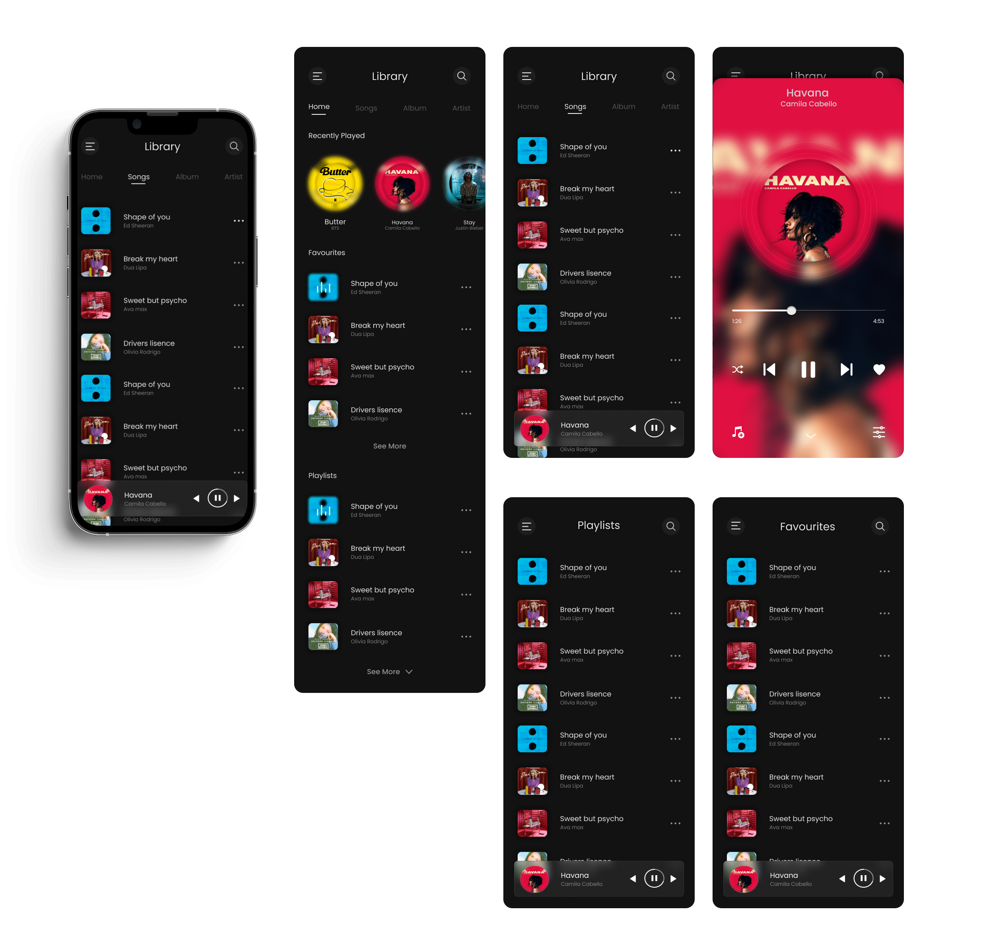

# Flutter project - music app

**App name** : Music

**Description** : Music app using flutter to play local audio files for android only.

**Features :**

- Play local audio files
- Query songs, artists, albums
- Create, edit, remove playlists
- Mark as favourite
- Search songs
- Dark mode

#### **How to install**

1. Clone repository

   > https://github.com/msmurali/flutter_music_app.git

2. Get packages

   > flutter pub get

3. Run project

   > flutter run

#### **Todos**

- Add push notifications
- Bug fixes
- Multi selection

#### **Project Structure**

<pre>
lib:
│ generated_plugin_registrant.dart
│ main.dart
└───src
│ app.dart
├───data
│ ├───models
│ │ playlist.dart
│ ├───providers
│ │ artwork_provider.dart
│ │ favourites_provider.dart
│ │ playlists_provider.dart
│ │ provider.dart
│ │ queue_provider.dart
│ │ recents_provider.dart
│ │ songs_provider.dart
│ └───services
│ app_permissions.dart
│ favourites_services.dart
│ hive_services.dart
│ player_services.dart
│ playlist_services.dart
│ preferences_services.dart
│ queue_services.dart
│ recents_services.dart
├───global
│ └───constants
│ constants.dart
│ enums.dart
│ index.dart
├───interface
│ ├───router
│ │ app_router.dart  
│ ├───screens
│ │ favourites_screen.dart
│ │ home_screen.dart
│ │ info_screen.dart
│ │ player_screen.dart
│ │ playlists_screen.dart
│ │ preferences_screen.dart
│ │ search_screen.dart
│ │ songs_screen.dart
│ ├───themes
│ │ themes.dart
│ ├───utils
│ │ custom_icons.dart
│ │ helpers.dart
│ └───widgets
│ app_bar_button.dart
│ back_button.dart
│ circular_artwork.dart
│ circular_icon_button.dart
│ circular_progress_bar.dart
│ circular_tile.dart
│ custom_list_tile.dart
│ error_indicator.dart
│ favourites.dart
│ grid_tile.dart
│ home_tab.dart
│ loading_indicator.dart
│ mini_player.dart
│ music_artwork.dart
│ music_library.dart
│ music_tab.dart
│ placeholder_image.dart
│ playlists.dart
│ playlists_dialog.dart
│ playlist_form.dart
│ preferences_option.dart
│ recents.dart
│ scaffold_with_sliding_panel.dart
│ sorting_preferences.dart
│ theme_preferences.dart
│ tile.dart
│ toast.dart
│ view_preferences.dart
│
├───logic
│ │ player.dart
│ └───bloc
│ │ index.dart
│ ├───favourites_bloc
│ │ bloc.dart
│ │ favourites_bloc.dart
│ │ favourites_events.dart
│ │ favourites_state.dart
│ ├───playback_mode_bloc
│ │ bloc.dart
│ │ playback_mode_bloc.dart
│ │ playback_mode_events.dart
│ │ playback_mode_state.dart
│ ├───player_bloc
│ │ bloc.dart
│ │ player_bloc.dart
│ │ player_events.dart
│ │ player_state.dart
│ ├───playlists_bloc
│ │ bloc.dart
│ │ playlists_bloc.dart
│ │ playlists_events.dart
│ │ playlists_state.dart
│ ├───preferences_bloc
│ │ bloc.dart
│ │ preferences_bloc.dart
│ │ preferences_events.dart
│ │ preferences_state.dart
│ ├───recents_bloc
│ │ bloc.dart
│ │ recents_bloc.dart
│ │ recents_events.dart
│ │ recents_state.dart
│ └───theme_mode_bloc
│ bloc.dart
│ theme_mode_bloc.dart
│ theme_mode_event.dart
│ theme_mode_state.dart
└───utils
initializer.dart
</pre>
